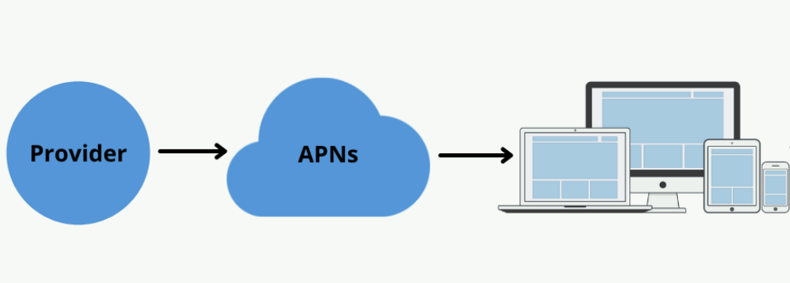

# 10장 알림 시스템 설계

### 0. 알림 시스템이란

최신 뉴스, 제품 업데이트 등 고객에게 중요할 만한 정보를 비동기적으로 제공하는 기능

모바일 푸시알림, SMS 메시지, 이메일 등이 있다.

### 1. 문제 설계

- 연성 실시간(soft real-time): 가능한 빨리 전달되어야 하지만, 시스템의 높은 부하시에 약간의 지연 허용
  - ↔ 경성 실시간 (hard real-time): dead line을 정하여 그 이전에 데이터를 반환해야만 유효한 결과로 처리
- 지원 기기: ios, android, laptop, desktop
- 사용자가 알림 받지 않도록 설정 가능하도록 설계 (opt-out)
- 전송량
  - 모바일 푸시알림 10,000,000 건
  - SMS메시지 1,000,000 건
  - 이메일 5,000,000 건

### 2. 개략적 설계

**2.1. 알림 유형별 지원 방안**

알림 제공자 → 알림 서비스 → 사용자 단말

- Provider(알림 제공자): 알림요청을 생성하여 알림 서비스에 전달하는 주체 = 단말 토큰 + 페이로드

  - 단말 토큰(device token): 고유 식별자
  - 페이로드(payload): 전달 값

- 서비스:
  - IOS 푸시: APNS(애플 제공)
  - 안드로이드 푸시: FCM(FIrebase Cloud Messaging)
  - SMS: Twillio, Nextmo
  - 이메일: 보통 자사 smtp 서버 혹은, 센드그리드, 메일침프 등
  - 카카오 API

**2.2. 연락처 정보 수집 절차**

- user → 1: 1 ← device
- user
  - user_id
  - email
  - phone_number
- device
  - device_token

**2.3. 알림 전송 및 수신 절차**

개략적 설계안 (초안)

- N개의 서비스
  - 마이크로 서비스 or 크론잡 or 분산 시스템 컴포넌트
  - 예시: 납기일을 알려주는 과금 서비스 혹은 배송 알림을 보내려는 쇼핑몰 웹사이트 등
- 알림 시스템
  - N개의 서비스에 알림 전송을 위한 API 제공 기능 필요
  - 제3자 제공 서비스에 전달할 알림 페이로드 생성 기능 필요
- 제 3자 서비스 (Third party service)
  - 사용자에게 알림을 실제 전달하는 서비스
  - 확장성(extensibility): 쉽게 새로운 서비스를 통합하거나 기존 서비스 제거에 열려있어야한다.
- 단말

  - IOS, Android 등 자기 단말

- 문제점 (하나의 알림 시스템 서버로 인한)
  - SPOF
  - 규모확장성: 데이터베이스나 캐시 등 중요 컴포넌트의 규모를 개별적으로 늘릴 방법이 없음
  - 성능 병목: 트래픽이 몰리는 시간 대에 장애가 일어날 확률이 높음

개략적 설계안(개선된 버전)

- 문제 해결
  - 데이터베이스와 캐시를 알림시스템에서 분리
  - 알림 서버 증설 및 수평적 규모 확장 자동화(오토 스케일링)
  - 메시지 큐를 이용하여, 시스템 컴포넌트 사이의 강한 결합 제거

1. N개의 서비스 → 알림 시스템 서버의 API를 통해 알림을 보낼 서비스들
2. 알림 서버
   - 알림 전송 규약: 사내 서비스 혹은 인증된 클라이언트만 사용 가능 (악용 방지)
   - 알림 검증: 이메일, 전화번호 등에 대한 기본적 검증 수행
   - 데이터베이스, 캐시 쿼리: 알림에 포함될 기능 가져오기
   - 알림 전송: 알림 데이터를 메시지 큐로 전달 → 하나 이상의 큐를 사용하므로 병렬적 처리 가능
3. 캐시: 사용자 정보, 단말 정보, 알림 템플릿 등을 캐싱
4. 디비: 사용자, 알림, 설정 등 저장
5. 메시지 큐
   - 시스템 컴포넌트 간 의존성 제거
   - 다량의 알림 전송의 경우 버퍼 역할
   - 알림의 종류 별로 메시지 큐를 사용함으로서, 서버 장애에 대비
6. 작업 서버 → 알림을 메시지 큐에서 3자 서비스로 전달
7. 3자 서비스
8. 단말

### 3. 상세 설계

**3.1. 안정성(reliability)**

- 데이터 손실 방지
  - 순서가 틀려도 되지만 소실되면 안됨
  - 알림 데이터를 보관 및 재시도 메커니즘 구현 필요
    
- 알림 중복 전송 방지
  - 분산시스템 특성상 중복 전송을 완전히 막는 것은 불가능하나 빈도를 줄여야함
  - 방법: 알림 도착 → 이벤트 ID 중복 검사 → 전송 or 폐기

**3.2. 추가로 필요한 컴포넌트 및 고려사항**

- 알림 템플릿
- 알림 설정 → 전송될 채널 별 opt in 여부
- 전송률 제한 (rate limiting) → 너무 많은 알림은 사용자가 아예 꺼버리게 할 수도 있어서 알아서 조정
- 재시도 메커니즘 → 전송 실패시 재시도 전용 큐로 전달
- 보안 → 인증된 클라이언트만 전송할 수 있도록 (security in push notification)
- **큐에 보관된 알림에 대한 모니터링** → 큐에 쌓인 알림의 개수가 너무 많은지 확인 (증설 필요)
- 이벤트 추적 → 데이터 분석시 활용

**3.3. 개선된 설계안**

- 재시도 기능 추가 → 전송 실패 대응 (지정된 횟수만큼 재시도)
- 전송 템플릿을 사용한 일관성 유지
- 모니터링을 통해 시스템 개선
