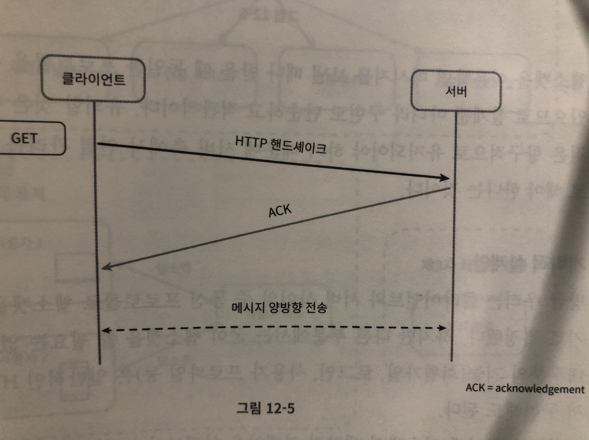
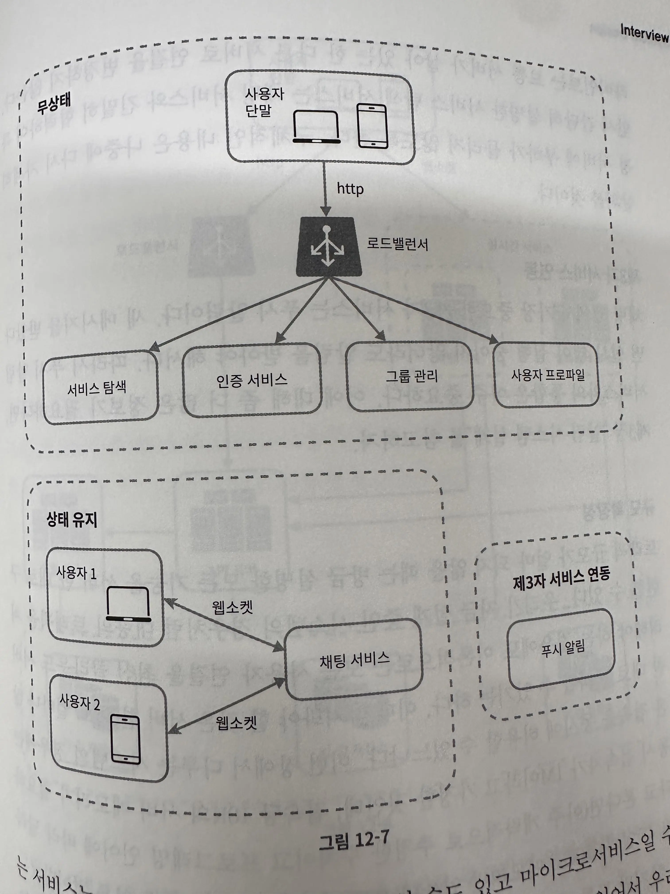

# 12장 채팅 시스템 설계

### 1. 문제 설계

- 1대1 채팅 및 최대 100명의 그룹 채팅
- 접속 상태 표시 기능
- 모바일 앱 및 웹 지원, 하나의 계정으로 동시 접속 지원
- 푸시 지원
- DAU 50,000,000

### 2. 개략적 설계

[Sender] 메시지 송신 클라이언트 → 채팅 서비스 → [Receiver] 메시지 수신 클라이언트

**2.1. 기본 기능**

- 클라이언트들로 부터 메시지 **수신**
- 메시지 수신자 **결정 및 전달**
- 수신자가 접속 상태가 아닌 경우에 접속할 때까지 해당 메시지 **보관**

**2.2. 메시지 송신**

- 기본적으로 HTTP 프로토콜을 사용
- 헤더에 Keep alive를 추가함으로서, 핸드 셰이크 감소 > 통신 비용 감소

```jsx
Connection: Keep-Alive
Keep-Alive: timeout=5, max=100
```

- http 1.0: 기능을 지원하였으나 구현이 일관적이지 않았음 (표준화의 부족으로 프록시에서 지원을 안하는 등)
- http: 1.1: 기본적으로 keep alive 활성화
  ```jsx
  "In HTTP/1.1, all connections are considered persistent unless declared otherwise (e.g., "Connection: close")."
  ```
- http 2.0: 멀티플렉싱 도입

  - 한 번의 핸드셰이크로 TCP 유지
  - keep alive → 순차적 요청 처리
  - 멀티플렉싱 → 병렬적 요청 처리
  - 예시

    - HTTP 1.1 keep-alive

      1. html 요청

      ```jsx
      GET /index.html HTTP/1.1
      Host: example.com
      Connection: Keep-Alive
      ```

      1. css 요청

      ```jsx
      GET /styles.css HTTP/1.1
      Host: example.com
      Connection: Keep-Alive
      ```

      1. image요청

      ```jsx
      GET /image.jpg HTTP/1.1
      Host: example.com
      Connection: Keep-Alive
      ```

    - HTTP 2.0 멀티 플렉싱

      ```jsx
      GET /index.html HTTP/2
      Host: example.com

      GET /styles.css HTTP/2
      Host: example.com

      GET /image.jpg HTTP/2
      Host: example.com
      ```

**2.3. 메시지 수신**

1. 폴링
   1. 주기적으로 클라이언트가 서버에게 새 메시지 있냐고 물어봄
   2. 비용 증가
2. 롱폴링
   1. 새메시지를 받거나 타임아웃 될 때까지 세션 연결(keep alive) → 연결이 종료되면 같은 작업 반복
   2. 폴링의 단점 해결
   3. 하지만 여전히 비효율적
3. 웹소켓

   1. 웹 표준 (RFC 6455)
   2. HTTP 핸드쉐이크 (SYN + SYN-ACK + ACK) + ACK ⇒ 웹소켓

      

   3. 송신에 사용해도 괜찮대

**2.4. 개략적 설계안**



1. 대부분의 기능 (회원가입, 로그인 등) → 일반적인 HTTP / 채팅 부분만 웹소켓 사용
2. 채팅 시스템 = 무상태 서비스 + 상태유지 서비스 + 제 3자 서비스 연동

- **무상태 서비스**
  - 기본 API (회원가입 로그인 등)
  - 클라이언트가 접속할 채팅 서버의 DNS를 알려주는 API
- **상태유지 서비스**
  - 채팅서비스만이 유일하게 상태유지가 필요
  - 특정 서버에 부하가 몰리지 않도록 관리 필요
- **제 3자 서비스 연동**
  - 푸시 알림 서비스 → 실행중이 아닐 때에도 알림을 보내고 받아야됨.
- **규모확장성**
  - 트래픽이 크지 않다면, 한 대의 서버로도 당연히 구현이 가능하겠지만, SPOF와 같은 이슈를 생각하면 좋은 점수를 받기 힘듦.
  - 사진은, 지금까지 공부한 무상태 서비스를 모아놓은 것이니 읽어보도록하세요 ^-^
- **저장소**
  - RDB vs 키-값 저장소
  - 일반적인 데이터(사용자 정보, 친구 목록 등) → SQL (관리의 용이함, 데이터 무결성)
  - 채팅 이력 → 키-값 저장소
    - 채팅의 경우 읽기, 쓰기의 비율은 1:1 정도 (쓰기 비용 낮음)
    - 낮은 latency
    - RDB의 경우 롱테일( 조회가 빈번하지 않은 데이터 → 여기서는 오래된 채팅 이력) 을 잘 처리하지 못하는 경향이 있음.
      데이터가 많아져, 인덱스가 커지면 무작위접근을 처리하는 비용이 늘어난다.
    - 수평적 규모확장 용이
    - 페이스북 → HBase, 디스코드 → 카산드라
- **데이터 모델**

**1:1 채팅을 위한 메시지 테이블**

| message      |           |
| ------------ | --------- |
| message_id   | bigint    |
| message from | bigint    |
| message_to   | bigint    |
| content      | text      |
| created_at   | timestamp |

1:1 채팅을 지원하기 위한 메시지 테이블의 사례다. created_at을 사용하여 메시지 순서를 정할 수는 없는데, 서로 다른 두 메시지가 동시에 만들어질 수도 있기 때문이다.

**그룹 채팅을 위한 메시지 테이블**

| message    |           |
| ---------- | --------- |
| channel_id | bigint    |
| message_id | bigint    |
| message_to | bigint    |
| content    | text      |
| created_at | timestamp |

(channel_id, message_id)의 복합키를 기본 키로 사용한다.

- **메시지 ID**
  - 조건
    - message_id의 값은 고유해야 한다.
    - ID 값은 정렬 가능해야 하며 시간 순서와 일치해야 한다. 즉 새로운 ID는 이전 ID보다 큰 값이어야 한다.
  - 결론
    - ~~auto_increment (only in rdb)~~
    - snow flake
    - 지역적 순서 번호 생성기 **→** 같은 채팅 세션 안에서만 유일하면 됨

### 상세설계

1. 서비스 탐색
2. 메시지 흐름
   1. 1:1 채팅 메시지 처리 흐름
   2. 여러 단말 사이의 메시지 동기화
   3. 소규모 그룹 채팅에서의 메시지 흐름
3. 접속상태 표시
   1. 사용자 로그인
   2. 로그아웃
   3. 접속 장애
   4. 상태 정보의 전송

### 마무리

1. 미디어 파일 지원 방법
2. 종단 간 암호화
3. 캐시
4. 로딩속도 개선
5. 오류처리
