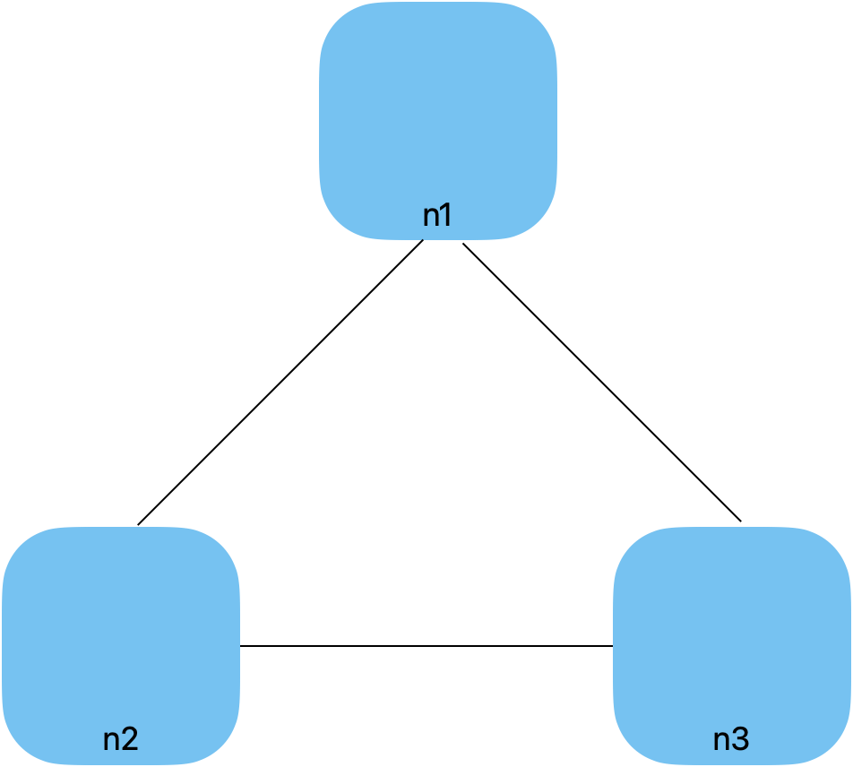
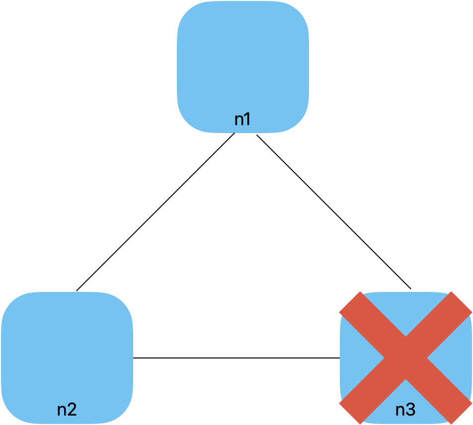
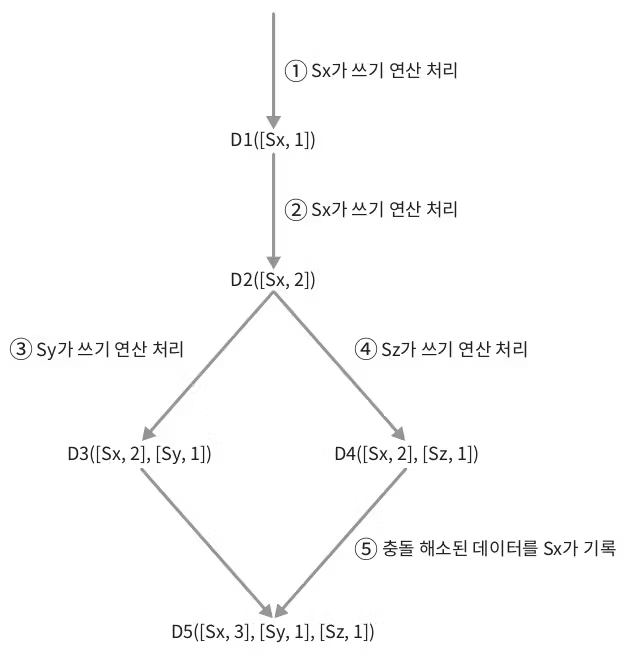
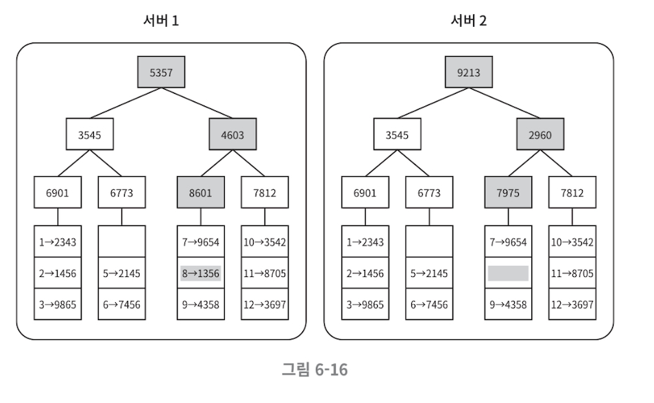

# 6장. 키-값 저장소 설계

## 목차

- [Key-Value 저장소란?](#Key-Value-저장소란)
- [문제 이해 및 설계 범위 확정](#문제-이해-및-설계-범위-확정)
- [단일 키-값 저장소](#단일-키-값-저장소)
- [분산 키-값 저장소 (== 분산 해시 테이블)](#분산-키-값-저장소--분산-해시-테이블)
  - [CAP 정리](#cap-정리)
  - [시스템 컴포넌트](#시스템-컴포넌트)
  - [시스템 아키텍쳐 다이어그램](#시스템-아키텍쳐-다이어그램)

## Key-Value 저장소란?

비 관계형 데이터베이스

- 고유 식별자(identifier)를 key로 가져야 함
- key-value 쌍으로 저장
- key
  - unique
  - 일반 텍스트 or 해시 값
  - 짧을수록 성능상 이점이 있음
- value
  - key를 통해서만 접근 가능
  - 문자 or list or object (무엇이든 상관없어야 함)
- 대표적인 예시
  - 아마존 다이나모 db
  - memcached
  - redis
- 이번 장에서 두 개의 연산을 지원하는 key-vaule 저장소를 설계해보자
  - put(key, value) : 저장
  - get(key): value 꺼내기

## 문제 이해 및 설계 범위 확정

데이터의 일관성과 가용성 사이에서 타협적으로 결정을 내린 설계를 만들어야 한다.

> 💡 이번 장에서 설계할 키-값 저장소의 특징
>
> - 키-값 쌍의 크기는 10KB 이하
> - 큰 데이터를 저장할 수 있어야 함
> - 높은 가용성
>   - 장애가 있더라도 빨리 응답해야 함
> - 높은 규모 확장성
>   - 트래픽 양에 따라 자동으로 서버 스케일 업/아웃 되어야 함
> - 데이터 일관성 수준은 조정이 가능해야 함
> - 응답 지연시간(Latency) 짧아야 함

## 단일 키-값 저장소

한 대의 서버만 사용하는 설계는 쉽다.

- 가장 직관적인 방법
  - 키-값 쌍 전부를 메모리에 저장
- 개선
  - 데이터 압축(compression)
  - 데이터 일부만 메모리, 나머지는 디스크에 저장

결국 서버 한 대로 부족해지는 상황이 온다.

## 분산 키-값 저장소 (== 분산 해시 테이블)

### CAP 정리

> 💡 분산 시스템을 설계할 때, CAP 정리를 이해하고 있어야 한다.
> 어떤 점을 포기해야 할지, 면접관과 상의하고 그에 따라 시스템을 설계하도록 하자.

아래 세 가지 요구사항을 동시에 만족하는 분산시스템 설계가 **불가능**하다는 정리이다

- Consistency (일관성)
- Availability (가용성)
- Partition Tolerance (파티션 감내)

세 가지 요구사항 중, 어떤 두 가지를 만족하느냐에 따라 분류할 수 있다.

- CP 시스템 (가용성 희생)
- AP 시스템 (일관성 희생)
- CA 시스템 (파티션 감내X, 실제로 존재할 수 없는 시스템)

구체적인 사례로 살펴보자

**이상적 상태**

- 이상적인 환경에서는, 네트워크가 파티션되는 상황이 절대 없다. 따라서 일관성과 가용성 모두 만족
- 

**실세계의 분산 시스템**

- 그치만 분산 시스템은 파티션 문제를 피할 수 없다.
- 파티션 문제 발생 시, 일관성과 가용성 중 하나를 선택해야 함
- 

- CP 시스템 (일관성 택)
  - 세 서버 사이의 데이터 불일치 문제를 피해야 함
    - n3가 중단되었을 때 n1, n2에 대한 쓰기 연산도 중단시켜야 함
- AP 시스템 (가용성 택)
  - 낡은 데이터를 반환할 위험이 있더라도, 읽기 연산을 허용해야 함
    - 파티션 문제 해결 이후에 새 데이터를 n3에 전송

### 시스템 컴포넌트

키-값 저장소 구현에 사용된 핵심 컴포넌트들 및 기술들 살펴보자

**[데이터 파티션]**

> 🛠 대용량 데이터를 한 대의 서버에 저장하는 것은 불가능하기 때문에, 데이터를 작은 파티션으로 분할해서 여러 서버에 저장하는 방식

데이터를 분할할 때 고민해야할 문제

- 데이터를 여러 서버에 고르게 분산해야 함
- 노드가 추가/삭제 될 때 데이터의 이동 최소화

안정 해시(consistent hash) (5장에 나왔음)

- 위의 문제를 푸는데 적합한 기술
- 동작 원리
  - 서버를 해시 링에 배치
  - 데이터가 들어왔을 때, 어떤 서버에 저장할지 결정하려면
    - 우선 해당 데이터의 해시값을 기준으로 해시 링 위에 배치
    - 그 지점을 시작으로, 시계방향으로 순회하다 만나는 첫번째 서버에 저장
- 장점
  - 규모 확장 자동화(automatic scaling)
    - 서버 추가/삭제 시에 데이터의 이동을 최소한으로 대응할 수 있기 때문에
    - 시스템 부하에 따라 자동으로 서버 규모를 추가/삭제되도록 할 수 있음
  - 다양성 (heterogeneity)
    - 각 서버에 용량에 맟게 가상노드 수 조정 가능
    - 예를들어 고성능 서버는 여러대의 가상 노드를 갖도록 설정 가능

**[데이터 다중화 (replication)]**

> 🛠 높은 가용성과 안정성 확보를 위해,
> 데이터를 N개 서버에 비동기적으로 다중화 (N은 튜닝 가능한 값)

- 동작 원리
  - N개 서버를 선정하는 방식
    - 데이터의 해시값을 기준으로 해시 링 위에 배치한 후
    - 시계 방향으로 순회하면서 만난 N개의 노드에 데이터 사본을 저장
  - 주의할 점
    - 가상 노드 사용 시, 선택된 N개의 노드가, 실제로는 동일한 물리서버일 수 있음
      - 따라서, 노드를 선택할 때 동일한 물리서버를 선택하지 않도록 해야함
    - 동일한 데이터센터에 속한 노드는, 함께 장애날 수 있기 때문에 다른 센터에 사본을 보관할 수 있도록 하자

**데이터 일관성 (consistency)**

> 🛠 여러 노드에 다중화된 데이터는 적절한 동기화가 되어야 함
> 정족수 합의 프로토콜, 일관성 모델

정족수 합의 프로토콜 (Quorum Consensus Protocol)

- Read/Write 연산 모두에 일관성을 보장
- 관련 정의
  - N : 사본 개수
  - W : 쓰기 연산에 대한 정족수
    - 쓰기 연산이 성공했다 == 적어도 W개의 서버로부터 쓰기연산 성공 응답을 받아야 함
    - 즉, W 미만으로 성공 응답을 받을 경우 쓰기연산은 실패로 간주
  - R : 읽기 연산에 대한 정족수
    - 읽기 연산이 성공했다 == 적어도 R개의 서버로부터 읽기연산 성공 응답을 받아야 함
    - 즉, R 미만으로 성공 응답을 받을 경우 읽기연산은 실패로 간주
- 주의할 점
  - 쓰기연산
    - ❌ 데이터가 W대의 서버에만 기록된다
    - 🟢 데이터가 최소 W대의 서버에는 기록되어 있음을 보장한다
      - 모든 서버에 쓰기연산을 전송한 후, W개의 성공응답을 받은 후에는 더 이상 기다리지 않을 뿐
      - 실제로 W이상의 서버에 쓰기연산이 성공했을 수 있음
  - 읽기연산도 마찬가지
- W, R, N 값을 타협해야 한다
  - W, R가 모두 1일 경우
    - 응답속도는 매우 빠를 것
    - 데이터 일관성 수준은 낮음
  - W, R가 커질수록
    - 응답 속도는 느려질 것
    - 데이터 일관성 수준은 높아짐
  - W + R > N 일 경우, 강한 일관성(strong consistency)이 보장됨
- 면접 시에 어떻게 정해야 할까?
  - 요구되는 일관성 수준에 따라 값을 조절하면 됨
  - 빠른 읽기 연산에 최적화된 시스템
    - R=1, W=N
  - 빠른 쓰기 연산에 최적화된 시스템
    - R=N, W=1
  - 강한 일관성 보장됨
    - W + R > N (보통, N=3, W=2, R=2)
  - 강한 일관성 보장되지 않음
    - W + R ≤ N
- 추가 자료
  - [분산 시스템의 내결함성을 높이는 뗏목 합의 알고리즘(Raft Consensus Algorithm)과 정족수(Quorum) 개념 알아보기](https://seongjin.me/raft-consensus-algorithm/)
  - [Raft | ConsenSys GoQuorum](https://docs.goquorum.consensys.io/configure-and-manage/configure/consensus-protocols/raft)

일관성 모델 (consistency model)

- 종류
  - 강한 일관성 (strong consistency)
    - 무조건 항상 최신결과만 반환
    - 달성 방법 :
      - 모든 사본에 최근 데이터가 반영될 때 까지, 해당 데이터에 대한 연산 금지
      - 고가용성 시스템에 적합하지 않음
  - 약한 일관성 (weak consistency)
    - 최신결과가 아닐 수도 있음
  - 결과적 일관성 (eventually consistency) ✅ (이번 장에서 채택)
    - 약한 일관성의 한 형태, 갱신 결과가 결국에는 모든 사본에 반영 (동기화)
    - 다이나모, 카산드라 등의 저장소가 채택한 모델
    - 쓰기연산이 병렬적으로 발생할 때, 저장된 값의 일관성이 깨질 수 있음
      - 클라이언트에서 버전 정보를 활용해 해결해야 한다

**[일관성 불일치 해소 (inconsistency resolution)]**

> 🛠 비 일관성 해소 기법 : 데이터 버저닝, 벡터 시계

데이터 버저닝

- 데이터를 변경할 때 마다, 해당 데이터의 새로운 버전을 만드는 것
- 각 버전의 데이터는 변경불가능(immutable)한 셈
- 동작 원리
  
  - 충돌(conflict) : 위의 예시 처럼, 동일한 요청에 대해 다른 응답을 받았을 때
  - 두 값 중 어떤 값을 채택해야 할까?
    - 벡터 시계(vector clock)으로 해결

벡터 시계 (vector clock)

- [서버, 버전]의 순서쌍을 데이터에 매달아 놓는 것
- 어쩐 버전이 최신인지, 충돌이 있는지 판별하는데 쓰임
- `D([S1, v1],[S1,v2],[S2, v2], … , [Sn, vn])`
  - D : 데이터
  - vi : 버전 카운터
  - Si : 서버 번호
- D를 서버 Si에 기록할 때 아래 두 작업중 하나를 수행해야 함
  - [Si, vi]가 있으면 vi 증가
  - 없으면, 새로 만들기 [Si, v1]
- 예시
  - 
  - 클라이언트가 D3, D4를 읽으면 충돌이 발생한다.
  - 클라이언트가 자체 로직으로 충돌을 해결하고, 충돌 해소된 데이터를 서버에 다시 기록하는 방식
- 장점
  - 충돌 여부를 쉽게 판단할 수 있음
- 단점
  - 클라이언트에 충돌 감지 및 해소 로직이 필요
    - ??
  - [서버:버전] 의 순서쌍 개수가 빠르게 증가
    - 임계치를 정하고, 이상으로 길이가 길어지면 오래된 순서쌍을 벡터에서 제거해야 함

**[장애 처리]**

> 🛠 장애는 피할 수 없어서 어떻게 감지하고 처리할지가 중요하다

장애 감지 기법 (failure detection)

- 분산시스템에서는 보통 두 대 이상의 서버가 동일하게 서버 A의 장애를 보고해야 실제 장애로 간주한다
- 가십 프로토콜
  - 동작 원리
    - 각 서버는, 자신을 포함한 모든 서버의 [서버:박동카운터] 쌍의 목록을 유지
    - 주기적으로 자신의 박동카운터를 증가
    - 각 노드는 랜덤한 다른 노드들에게 자기가 보유한 [서버:박동카운터] 목록을 전송
    - 이 목록을 받은 노드는, 본인이 유지하는 목록을 최신값으로 갱신 (받은 값으로 갱신)
    - 어떤 서버의 박동 카운터 값이 일정시간동안 갱신되지 않으면 장애로 간주

일시적 장애 처리

- 장애를 감지한 이후 어떻게 조치해야하느냐
- 느슨한 정족수 접근법으로 가용성을 높인다
  - W, R 개의 건강한 서버를 해시 링에서 선택 (장애 서버 제외)
- 임시 위탁(hinted handoff) 기법
  - 장애 상태인 서버로 가는 요청은, 다른 서버가 맡아서 처리
  - 그 동안 발생한 변경사항은 서버 복구 후 반영
  - 이를 위해, 임시로 쓰기연산을 처리한 서버는 단서를 남겨야함

영구 장애 처리

- 빈 앤트로피 프로토콜
  - 사본들을 비교하여 최신버전으로 갱신
  - 전송 데이터 양을 줄이기 위해 머클(Merkle) 트리 사용
- 머클트리 (== 해시트리 라고도 불림)
  - 리프 노드가 아닌 모든 노드는 자식 노드의 해시 값들을 결합하여 해시한 값을 포함
  - 최종적으로 루트 노드는 전체 트리의 해시 값을 대표하는 "머클 루트(Merkle Root)"
  - 완성된 머클트리 예시
    - 루트노드부터 값을 비교해 나간다, 값이 다른쪽 리프가 동기화가 필요한 데이터를 포함한 리프이다
    - 이렇게 비교해나가면 최종적으로 동기화가 필요한 데이터만 확인 가능하다
    - 따라서, 동기화해야 하는 데이터의 양은 실제로 오류가 발생한 데이터의 숫자,크기에 비례할 뿐 - 서버에 보관된 데이터의 총량과 무관
      

데이터 센터 장애 처리

- 여러 데이터 센터에 다중화하는게 중요

### 시스템 아키텍쳐 다이어그램

설계의 결과물을 만들어보자

- 주요 기능
  - 클라이언트는 kv저장소가 제공하는 두 가지 단순한 API와 통신
    - put, get
  - 중재자는 클라이언트와 kv저장소 사이에 proxy 역할
  - 노드는 안정해시의 해시링 위에 분포
  - 노드를 자동으로 추가/삭제 할 수 있도록 완전히 분산된 시스템
  - 데이터는 여러 노드에 다중화
  - 모든 노드가 동일한 책임을 짐, SPOF 없음

**쓰기 경로 (write path)**

1. 쓰기 요청이 커밋 로그 파일에 기록됨
2. 데이터가 메모리 캐시에 기록됨
3. 메모리 캐시가 가득 차거나 사전에 정의된 임계치에 도달하면
   - 데이터는 디스크에 있는 `SSTable(Sorted-String Table)`에 기록됨
   - (`SSTable`은 [키,값] 순서쌍을 정렬된 리스트 형태로 관리하는 테이블)

**읽기 경로 (read path)**

데이터가 메모리 캐시에 있을 경우

데이터가 메모리 캐시에 없을 경우

읽기 요청을 받으면

- 메모리 캐시부터 확인
  - 메모리에 데이터가 있으면 바로 메모리에서 반환
  - 메모리에 데이터가 없으면 디스크에서 가져온다.
    - 어떤 `SSTable`에 찾는 키가 있는지 알아 내기 위해`Bloom filter`가 흔히 사용된다.
    - `SSTable`에서 데이터를 가져와서 반환
