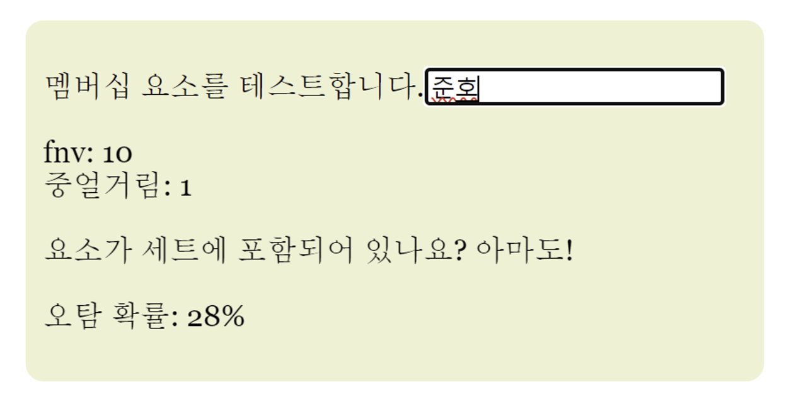

## 🔷 1단계 : 문제 이해 및 설계 범위 확정

### 질문을 통해 알아낸 요구사항

- 쓰기 연산: 매일 1억 개의 단축 URL 생성, 초당 1160
- 읽기 연산 : 초당 11,600
- 10년간 서비스 운영시 1억개의 레코드 보관
- 축약 전 URL 평균길이 : 100

⇒ 10년 동안 필요한 저장 용량 36.5TB

## 🔷 2단계 : 개략적 설계안 제시 및 동의 구하기

### API 엔드포인트

[1] RESTful API

기본적으로 두 개의 엔드포인트가 필요하다.

1. **URL 단축용 엔드포인트**

`POST/api/v1/data/shorten`

- 인자 : 단축할 URL
- 반환 : 단축 완료한 URL

1. **URL 리디렉션용 엔드포인트**

`GET /api/v1/shortUrl`

- 반환 : 원래 URL

### URL 리디렉션

> 단축 URL을 받은 서버(우리가 설계한 서버)가 원래 URL로 바꾸어 301 응답의 Location 헤더에 넣어 반환한다.

Redirection에 관한 status, header 제공

### [301 Permanently Moved](https://developer.mozilla.org/ko/docs/Web/HTTP/Status/301)

---

> 요청한 리소스가 [`Location`](https://developer.mozilla.org/ko/docs/Web/HTTP/Headers/Location) 헤더에 주어진 URL로 완전히 옮겨졌다는 것을 나타낸다. 브라우저는 이 페이지로 리디렉트하고, 검색 엔진은 해당 리소스로 연결되는 링크를 갱신합니다.

- 영구적으로 옮겨졌으므로 응답을 캐시한다.
  - 브라우저는 캐시된 원래 URL로 요청을 보낸다.

### [302 Found](https://developer.mozilla.org/ko/docs/Web/HTTP/Status/302)

---

> 요청한 리소스가 [`Location`](https://developer.mozilla.org/ko/docs/Web/HTTP/Headers/Location) 헤더에 지정된 URL로 일시적으로 이동되었음을 나타낸다. 브라우저는 이 페이지로 리디렉션되지만 검색 엔진은 리소스에 대한 링크를 업데이트하지 않는다.
> ('SEO관점'에서는 'link-juice'가 새 URL로 전송되지 않는다고 합니다).

- 일시적이므로 캐시하지 않는다.
  - 즉, 언제나 단축 URL서버에 먼저 요청이 간다.

\*트래픽 분석 등 단축 URL 서버에서 모든 요청을 받아보는 것이 유의미한 경우, 302를 사용하는 것이 좋을 수 있다.

- else
  ### [**307 Temporary Redirect**](https://developer.mozilla.org/ko/docs/Web/HTTP/Status/307)
  ***
  - 다이렉트시 **요청 메서드와 본문 유지**
  ### [**303 See Other**](https://developer.mozilla.org/ko/docs/Web/HTTP/Status/303)
  - 요청에 대한 응답으로 GET 메소드를 사용

### URL 단축

결국 중요한 것은 해시 값으로 대응시킬 해시함수를 찾는 것

**요구사항**

- 긴 URL이 다르면 해시 값도 달라야 한다.
- 해시 값은 원래의 긴 URL로 복원될 수 있어야 한다.

## 🔷 상세 설계

### 데이터 모델

- 해시테이블
  - 메모리 비쌈 → rdb에 저장

### 해시 함수

---

**해시 값 길이**

- 요구사항 : 단축 URL은 알파벳과 숫자로만 이루어져야한다

\*[0-9, a-z, A-Z]. 즉, 62개의 문자를 사용할 수 있다.

- hashValue의 길이를 정하기 위해서는 `62^n >= 3650억` 을 만족하는 n의 최소값을 찾아야 한다.
  ⇒ n이 7이면 3.5조개의 URL 만들 수 있음
  → hashValue의 길이를 7로 결정

**해시 함수 사용 & 해시 후 충돌 해소**

`CRC32`, `MD5`, `SHA-1` 함수 모두 결과가 7글자보단 길다.

**solution** 앞자리 7개만 사용

- longURL → 해시함수 → DB

→ 겹치면 ?

- longURL + “사전 정의 문자열” → 해시함수 → DB
  - 충돌나지 않을 때까지 반복

- 충돌나는지 여부를 확인하기 위해 원래의 URL과 단축 URL을 저장한 DB에 쿼리를 날려 작업 당 한번 이상의 쿼리는 무조건 발생
  ⇒ 오버헤드가 크다.
- \*블룸 필터 사용 [2]
  - 어떤 집합에 특정 원소가 있는지 검사하는데 사용하는 **확률형 자료구조**
  - Bloom filters는집합 내에 특정 원소가 존재하는지를 확인할 때 사용되는 자료구조
  **특징**
  1. 공간/시간의 트레이드 오프
  2. 해시
  3. 일부 에러를 허용
  ***
  
  - 해싱 함수를 이용해서 원소를 해싱한 다음, 위 그림처럼 모두 더하기
  - 원소의 존재 여부를 검사할 때
    - 검사 대상 원소를 해싱한 다음 Bloom Filter에 계산된 해시가 마스킹되어 있는지 확인하는 것이죠.
  - **Google Chrome은 위험한 사이트 검사에 Bloom Filter를 사용**
  - 비트 코인도 내부적으로 사용
  - Bloom Filter가 어떤 자료 구조인지 웹에서 눈으로 확인해볼 수 있음
    - 새로 추가된 항목을 표시하기 위해 녹색
  [Bloom Filters by Example](https://llimllib.github.io/bloomfilter-tutorial/)
  
  
  - 테스트
    
    
  
  - 블룸 필터 계산기
  [Bloom filter calculator](https://hur.st/bloomfilter/)

**base-62 사용**

- 표현 방식이 다른 두 시스템에서 같은 수를 공유할 때 유용

1. longURL 입력
2. DB에 원래의 URL이 존재하는가 검사 (단축된 URL이 만들어진 적이 있나?)
3. 없으면, 유일성을 보장하는새로운 ID를 생성
4. 생성된 ID를 단축 URL(62진법 변환)로 변환
5. 원래의 URL, 단축 URL을 DB에 저장 및 반환

| 해시 후 충돌 해소 전략                                                                    | base-62 변환                                                                                                                 |
| ----------------------------------------------------------------------------------------- | ---------------------------------------------------------------------------------------------------------------------------- |
| 단축 URL의 길이가 고정됨                                                                  | 단축 URL의 길이가 가변적. ID 값이 커지면 같이 길어짐                                                                         |
| 유일성이 보장되는 ID 생성기가 필요치 않음                                                 | 유일성 보장 ID 생성기가 필요                                                                                                 |
| 충돌이 가능해서 해소 전략이 필요                                                          | ID 유일성이 보장된 보장된 후에야 적용 가능한 전략이라 충돌은 아예 불가능                                                     |
| ID로부터 단축 URL을 계산하는 방식이 아니라서 다음에 쓸 수 있는 URL을 알아내는 것이 불가능 | ID가 1씩 증가하는 값이라고 가정하면 다음에 쓸 수 있는 단축 URL이 무엇인지 쉽게 알아낼 수 있어서 보안상 문제가 될 소지가 있음 |

## 🔷 마무리

면접관과 더 이야기 해보면 좋은 내용

- 처리율 제한 장치(rate limiter)
  - 엄청난 요청이 들어올 수도 → 필터링 규칙 (4장)
- 웹 서버의 규모 확장
  - 무상태 계층이므로 서버 증설, 삭제 가능
- 데이터베이스의 규모 확장
- 데이터 분석 솔루션(analytics)
  - 302( URL 단축 서버로 요청)를 이용해 링크와 관련된 정보 알아낼 수 있음 (클릭수, 빈도, 언제 클릭했는지 )
- 가용성, 데이터 일관성, 안정성
