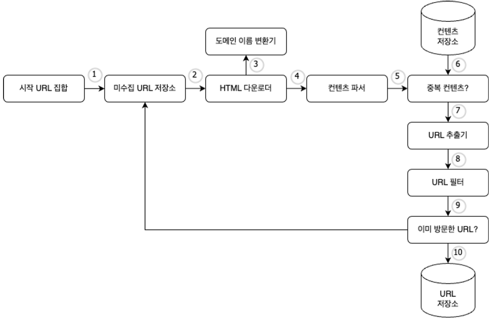
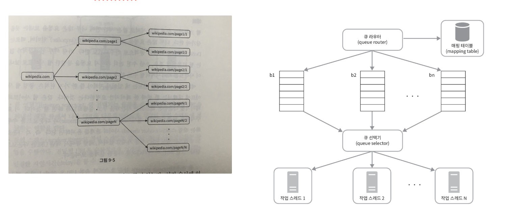
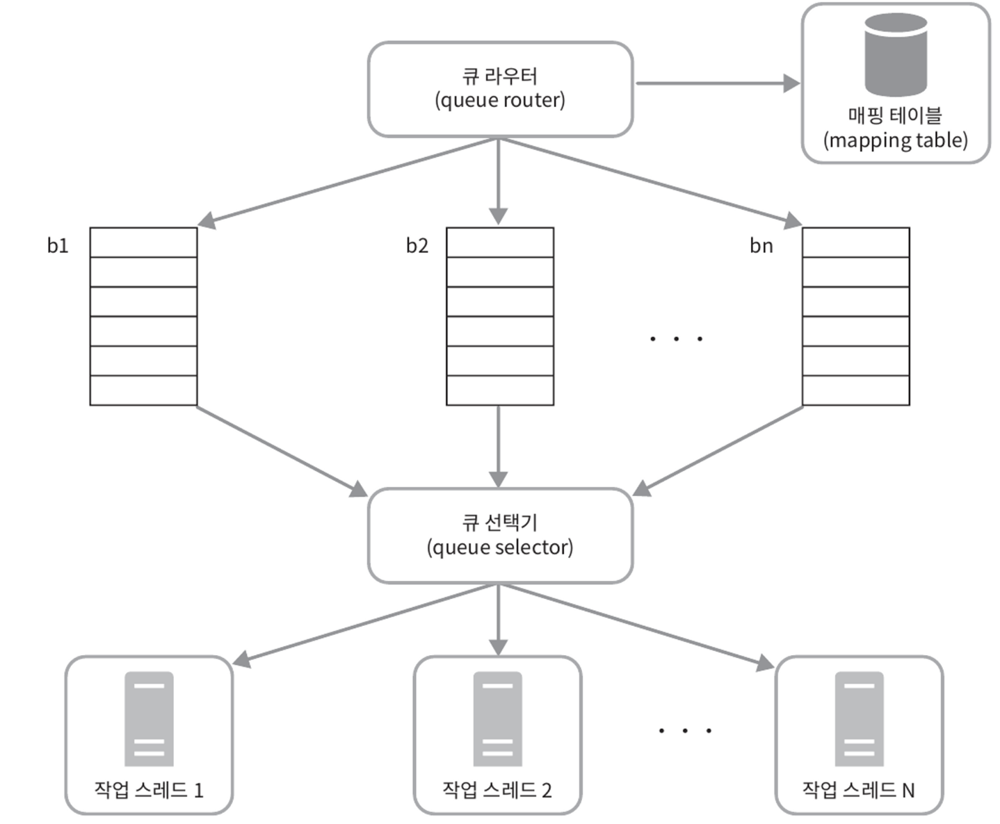
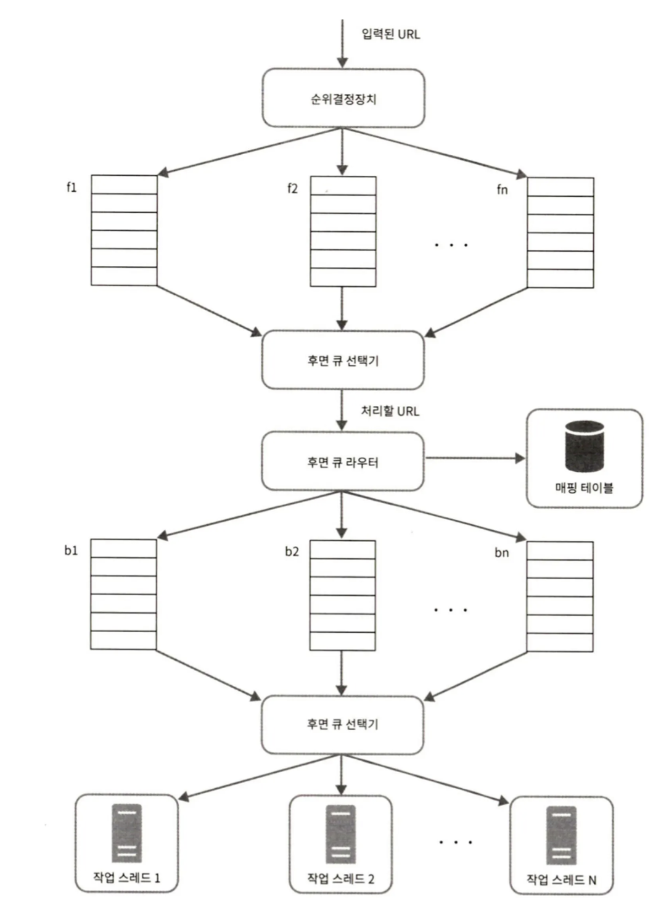
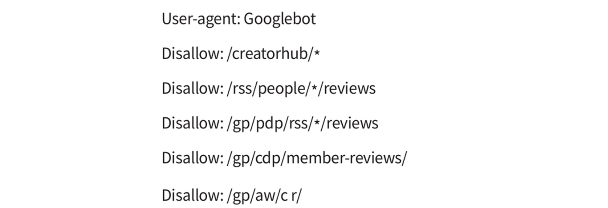
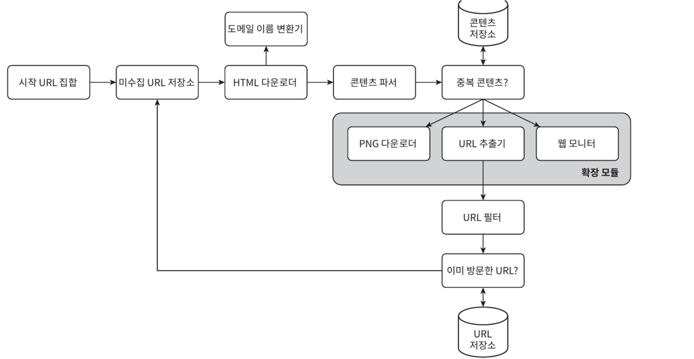

# 9장 웹 크롤러 설계

> 크롤러는 검색 엔진 인덱싱, 웹 아카이빙, 웹 마이닝, 웹 모니터링 에 사용 한다.

## 🍀 1단계 : 문제 이해 및 설계 범위 확정

> 감당해야 하는 데이터의 규모와 기능들을 알아내기

### 개략적 규모 추정

- 매달 10억 개의 웹 페이지를 다운로드
- 초 당 400 페이지 , 최대 800
- 웹 페이지 크기 평균 500K
- 매달 500TB 저장 용량
  - 5년간 30PB

## 🍀 2단계 : 개략적 설계안 제시 및 동의 구하기

**설계안 & 작업 흐름**

1. 시작 URL들을 **미수집 URL 저장소** 저장
2. 미수집 URL 저장소에서 URL 목록을 가져옴
3. **도메인 이름 변환기** 사용해서 URL로 부터 IP 주소 알아내고 웹 페이지 다운로드
4. HTML 페이지 **파싱** ,검증 : **콘텐츠 파서**
5. 중복 컨텐츠 확인

   1. 연구 결과에 따르면 29%는 중복, 웹페이지의 해시 값 비교[7]

   [rabin1981.pdf](https://prod-files-secure.s3.us-west-2.amazonaws.com/efdc8950-7fe7-4b97-bdc6-a09b05b3b02f/56123550-f3c4-4115-aa34-c0236d37f3bc/rabin1981.pdf)

6. 이미 **컨텐츠 저장소**에 있는지 확인.
   1. 이미 존재하면 버림
7. HTML 페이지에서 링크 고름 : **URL 추출기**
8. 골라낸 링크를 **URL 필터** 전달
9. 필터링 후 남은 URL만 중복 URL 판별 단계 전달
   1. 오류발생, 접근 제외 목록 등 배제
10. 이미 처리 한지 확인 후 저장소에 있음 버림
    1. 이 단계 구현을 위해 블룸 필터나 해시 테이블이 쓰인다. [4][8]
11. 저장소에 없으면 **URL 저장소**에 저장, 미수집 URL 저장소에도 전달

## 🍀 3단계 : 상세 설계

> 컴포넌트와 구현 기술

- **DFS vs BFS**
- **미수집 URL 저장소**
- **HTML 다운로더**
- **안정성 확보 전략**
- **확장성 확보 전략**
- **문제 있는 콘텐츠 감지 및 회피 전략**

---

### DFS vs BFS

- BFS (DFS는 깊이 가능 어려움)

**BFS 문제점**

- 링크(wikipedia.com)를 병렬로 처리
  → 위키피디아 서버는 수많은 요청으로 인해 과부하에 걸림
  **예의 없는 크롤러**로 간주

⇒ 페이지 순위, 사용자 트래픽의 양, 업데이트 빈도등의 척도로 우선순위 구별

### 미수집 URL 저장소

> 이 저장소를 잘 구현하면 “예의를 갖춘 크롤러”, URL 사이의 우선선위와 선선도를 구별하는 크롤러 구현 가능 [5][9]

[Lecture05.pdf](https://prod-files-secure.s3.us-west-2.amazonaws.com/efdc8950-7fe7-4b97-bdc6-a09b05b3b02f/42727a46-b11c-47cb-984b-b9b78ce04565/Lecture05.pdf)

[crawling_survey.pdf.crdownload](https://prod-files-secure.s3.us-west-2.amazonaws.com/efdc8950-7fe7-4b97-bdc6-a09b05b3b02f/16807b7a-ae45-4d5f-81dd-64d4382c82c6/crawling_survey.pdf.crdownload)

**예의**

짧은 시간 안에 너무 많은 요청을 보내는 것은 ‘무례한 일’

→ 원칙 : 동일 웹페이지는 한 번에 한번만 요청

- Queue Router : 같은 호스트에 속한 URL은 언제나 같은 큐로 가도록 보장
- FIFO 큐 : 같은 호스트는 같은 큐에 보관
- Mapping Table : 호스트 이름과 큐 사이의 관계를 보관하는 테이블

| 호스트    | 큐  |
| --------- | --- |
| wikipedia | a   |
| apple     | b   |
| …         | …   |
| naver     | z   |

- Queue Selecter : 큐 선택기는 큐들을 순회하며 큐에서 URL을 꺼내 큐에서 나온 URL을 다운로드하도록 지정 스레드에 전달한다.
- Worker Thread : 작업 스레드는 전달된 URL을 다운로드하는 작업을 수행한다. 전달된 URL은 순차처리 될 것이며 지연시간(Latency)를 둘 수 있다.

⇒ 호스트명과 다운로드를 수행하는 작업 스레드 사이의 관계를 유지

**우선순위**

- 유용성에 따라 페이지 랭크, 트래픽 양, 갱신 빈도 등 다양한 척도 사용해 URL 을 나눌 필요가 있다.
- 우선순위 결정 장치[5][10]
  - 우선 순위별로 할당, 우선순위가 높으면 선택 확률 높아짐.

- 전면 큐 (Front Queue) : 우선순위 결정 과정을 처리한다.
- 후면 큐 (Back Queue) : 크롤러가 예의 바르게 동작하도록 보장한다.

**신선도**

신선도를 위해 재수집할 필요가 있다.

- 웹 페이지 변경 이력 활용, 우선순위 활용

### 미수집 URL 저장소를 위한 지속성 저장장치

처리해야 하는 **수억 개의 URL을 메모리**에 **보관**하는 것은 안전성, 규모 확장성 측면에서 **안좋다. (**디스크 또한)

→ 본 설계안에서는 절충안으로 디스크 & 메모리 버퍼에 큐 사용(IO 비용 절감)

### HTML 다운로더

**Robots.txt : 다운로드 가능한지**

- Robots.txt는 웹 사이트가 크롤러와 소통하는 표준적 방법
  - 크롤러가 수집해도 되는 페이지 목록 : 캐시에 보관

**성능 최적화**

1. 분산 크롤링
2. 도메인 이름 변환 결과 캐시
   1. dns 요청은 동기적. 도메인과 IP 주소 사이의 관계를 캐시에 보관
3. 지역성
4. 짧은 타임아웃
   1. 최대 대기 시간 지정

### 안정성 확보 전략

- 안정 해시
  - 서버 분산할 때 적용 가능한 기술
- 크롤링 상태 및 수집 데이터 저장
  - 장애 발생 시 복구하기 위해
- 예외 처리
- 데이터 검증

### 확장성 확보 전략

새로운 유형의 콘텐츠 지원 가능하게 확장성을 신경 써야 한다.

### 문제 있는 콘텐츠 감지 및 회피 전략

- 중복 콘텐츠
  - 웹 30% 가량은 중복→ 해시, 체크섬 활용 해결[1]
- 거미덪
  - 무한 루프 페이지 → 길이, 알고리즘 → 수작업

## 🍀 4단계 : 마무리

좋은 크롤러

- 규모 확장성
- 예의
- 확장성

**추가 논의하면 좋은 것**

- 서버 측 렌더링
- 스팸 방지
- 데이터베이스 다중화, 샤딩
- 수평적 규모 확장성
- 가용성, 일관성, 안정성
- 데이터 분석 솔루션
