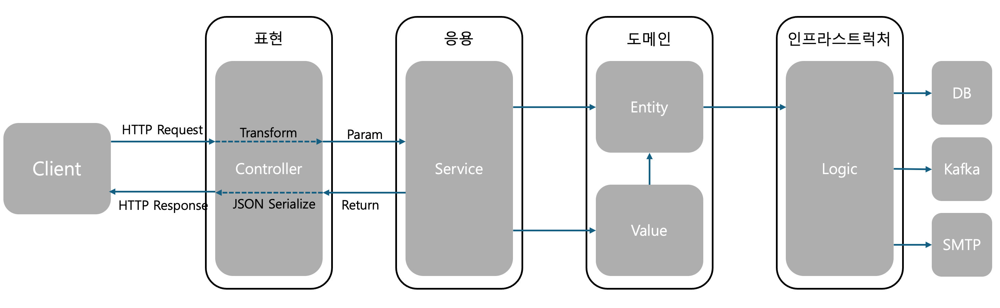
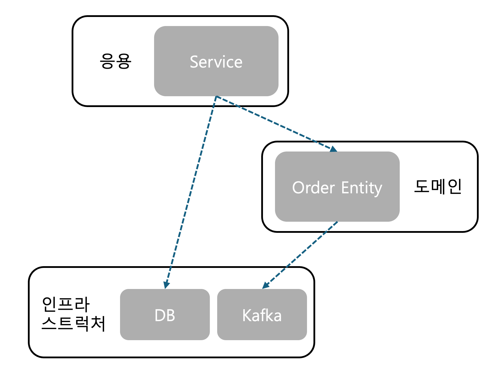
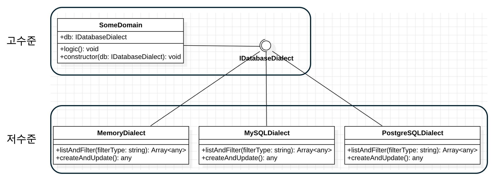

# Ch.2 아키텍쳐 개요    

## 애플리케이션의 네 영역

### 네개의 영역은 어떻게 상호작용하는가?

앞서 봤듯 애플리케이션 아키텍쳐를 설계할때는 `표현`, `응용`, `도메인`, `인프라스트럭쳐` 네개의 영역을 사용한다.

- `표현 영역`: 사용자의 요청을 받아 `응용 영역`이 필요로 하는 형식으로 변환 후 전달하고 응용영역의 처리 결과를 다시 사용자에게 보여준다.
- `응용 영역`: 기능을 구현하기 위해 `도메인 영역`의 도메인 모델을 사용한다. **응용 서비스는 로직을 직접 수행하기 보다는 도메인 모델에 로직 수행을 위임한다.**
- `도메인 영역`: [앞에서 보았던](./week1_ch1.md) Order, OrderLine, ShippingInfo 모두 도메인 모델 영역에 위치한다. **도메인 모델은 도메인의 핵심 로직을 구현한다**
- `인프라스트럭쳐 영역`: `인프라스트럭쳐 영역`은 구현 기술을 다루는 영역이다. RDB, NoSQL 연동부터 Kafka, RMQ와 같은 메세지 큐 연동 후 메시지 폴링, 푸시 로직 등을 구현한다. `인프라스트럭쳐 영역`은 논리적인 개념보다는 실제 구현을 다룬다.

즉 `도메인 영역`, `응용 영역`, `도메인 영역`은 구현 기술을 사용한 로직을 직접 다루지 않고 `인프라스트럭쳐 영역`에서 제공하는 기능을 활용하여 필요한 기능을 개발한다.



### 계층 구조 아키텍쳐

위의 다이어그램을 알 수 있듯이 **계층 구조에서는 상위 계층에서 하위 계층(순서대로 표현 -> 응용 -> 도메인 -> 인프라스트럭쳐)으로의 의존만 존재하고 하위계층이 상위 계층에 의존하진 않는다**.

엄격하게 구조를 적용한다면 위 4개의 계층 순서를 지켜야하지만 구현의 편리함을 위해 유연한 계층 구조를 가지기도 한다. 예를 들어 `응용 계층`이 `인프라스트럭쳐 계층`에 바로 의존하는것과 같이 말이다.



이러한 계층 구조에서 문제점은 `표현 계층`, `응용 계층`, `도메인 계층`이 모두 상세구현에 있어 `인프라스트럭처 계층`에 종속된다는 점이다.

```typescript

// Service
class SomeDomain {
  private db: MySQLDialect

  logic() {
    // Some Codes

    this.db.createOrUpdate()
  }

  constructor() {
    this.db = new MySQLDialect()
  }
}

class SomeDomain2 {
  private db: MySQLDialect

  logic() {
    // Some Codes

    this.db.listAndFilter('mysql-filter1')
  }

  constructor() {
    this.db = new MySQLDialect()
  }
}

class MySQLDialect {

  listAndFilter(filterType: 'mysql-filter1' | 'mysql-filter2') { }

  createOrUpdate() { }

}
```
위 코드를 봤을때 문제점이 보이지 않을 수 도 있다. 하지만 두가지의 문제점을 가지고 있다.

#### 테스트 하기 어렵다.
첫번째는 테스트하기 어렵다는 점이다. 예를 들어 `SomeDomain`를 테스트 한다고 가정해보자. 이를 테스트 하기 위해서는 `MySQLDialect`가 동작해야하는데 이를 위해서는  Mock DB, 테스트용 DB 연결등과 같이 `MySQLDialect`에 대한 설정이 이루어진 후 동작을 확인할 수 있다.

#### 기능 확장이 어렵다
두번째는 기능 확장이 어렵다는 점이다. 위 코드에서 `MySQLDialect`의 `listAndFilter`의 매개변수인 `filterType`에서 `mysql-filter1`이라는 값은 MySQL에 종속되는 필터이다. 만약에 DB를 PostgreSQL과 같은 다른 RDB로 변경한다면 MySQLDialect를 PostgresDialect로 변경할 뿐만 아니라 SomEntity의 코드도 변경해주어야 하는 문제점이 발생한다.

이를 해결할 수 있는 방법은 `DIP`를 사용하는 것이다.

## DIP

`SomeDomain`와 `MySQLDialect`는 `고수준 모듈`과 `저수준 모듈` 관계이다.

- 고수준 모듈: 의미있는 단일 기능을 제공한다.(기능단위)
- 저수준 모듈: 하위 기능을 실제로 구현한 것이다.(기능에 활용되는 구현기술을 사용)

위에서 보았듯이 고수준 모듈이 저수준 모듈을 사용하면 `기능 확장`과 `테스트` 측면에서 어려움이 있었다.

`DIP`를 활용하면 저수준 모듈이 고수준 모듈에 의존하도록 할 수 있으며, 이는 인터페이스를 통한 추상화를 활용하여 구현할 수 있다.

```typescript

class SomeDomain {
  private db: IDatabaseDialect

  logic() {
    // Some Codes

    this.db.createOrUpdate()
  }

  constructor(dialect: IDatabaseDialect) {
    this.db = dialect
  }
}

interface IDatabaseDialect {
  listAndFilter(filterType: 'type1' | 'type2'): Array<any>;

  createOrUpdate(): any;
}

class MemoryDialect implements IDatabaseDialect {
  listAndFilter(filterType: "type1" | "type2"): any[] {
    return []
  }
  createOrUpdate() {
    return {}
  }

}

class MySQLDialect implements IDatabaseDialect {
  listAndFilter(filterType: "type1" | "type2"): any[] {
    let filter: 'mysql-filter1' | 'mysql-filter2' = 'mysql-filter1'
    switch (filterType) {
      case "type1":
        break;
      case "type2":
        filter = 'mysql-filter2'
        break;
    }
    return []
  }
  createOrUpdate() {
    return {}
  }
}

class PostgreSQLDialect implements IDatabaseDialect {
  listAndFilter(filterType: "type1" | "type2"): any[] {
    let filter: 'postgres-filter1' = 'postgres-filter1';
    switch (filterType) {
      case "type1":
        break;
      case "type2":
        throw new Error(`Postgres doesn't support ${filterType}`)
    }
    return []
  }
  createOrUpdate() {
    return {}
  }
}
```
모든 `인프라스트럭쳐 영역`에 해당하는 Dialect들은 `IDatabaseDialect`를 구현하고 `IDatabaseDialect`에만 집중하면 된다. 또한 테스트할때 `MemoryDialect`와 같이 Mock Database Dialect를 생성하여 기존 로직을 변경하지 않음과 동시에 테스트를 더 쉽게 만들 수 도 있다. 



**`IDatabaseDialect`는 `데이터베이스 연결 및 연산 수행`이라는 추상화만 의존할 뿐이므로, `고수준 모듈`에 속하게 된다. 애플리케이션 계층으로 해석해본다면, `MemoryDialect`, `MySQLDialect`, `PostgresDialect`는 모두 `인프라스트럭쳐 영역`이며, `IDatabaseDialect`는 `도메인 영역`에 해당되게 되는것이다.** UML로 이를 표현해보면, `저수준 모듈`이 고수준 모듈에 의존을 하게 되며, 이를 DIP(Dependency Inversion Principle, 의존 역적 원칙)이라고 부른다.

## 도메인 영역의 주요 구성 요소

`도메인 영역`은 도메인 핵심 모델을 구현한 영역이다. 앞서 살펴봤던 `엔티티`와 `밸류타입`은 도메인의 주요 구성요소이다. 도메인은 이 두 구성 요소 이외 요소도 지니고 있다.

- Entity
  - 고유 식별자를 갖는 객체이며 자신의 라이프 사이클을 갖는다.
  - 도메인의 고유한 개념(Order, Product, OrderLine)을 표현하며, 도메인 모델의 데이터, 관련 기능을 포함한다.
- Value Type
  - 하나의 개념적 데이터 단위를 표현할때 사용한다.(Money, Address, Receiver)
- Aggregate
  - 연관된 Entity, Value Type을 하나의 개념으로 묶은 것이다.
- Repository
  - 도메인 영속성을 처리한다.(DBMS, NoSQL등 연동)
- Domain Service
  - 특정 Entity에 종속되지 않는 로직을 제공한다. 로직이 여러 Entity와 Value Type을 필요로 하면 Domain Service에서 구현한다.

### Aggregate

- **도메인 모델이 고도화 됨에 따라 여러개의 Entity, Value Type이 생기게 된다.** 이런 경우 상위 수준이 아닌 개별 Entity에 초점을 맞추다 상위 수준에서 이해를 못하게 된다.
- Aggregate는 관련 객체를 하나로 묶은 군집이다.
- Aggregate는 Root Entity를 가지며, Aggregate를 사용하는 코드는 Root가 제공하는 기능을 실행하고, Root를 통해 간접적으로 다른 Entity, Value Type에 접근하게 된다.(캡슐화를 돕는다)
- Aggregate 구현시 고려할 점
  - 구성 방식에 따라 구현이 복잡해질 수 있다.
  - 트랜잭션 범위가 달라질 수 있다.
  - 선택한 구현 기술(`인프라스트럭쳐 영역`)에 따라 제약이 생길 수 있다.
- **모듈 구성시 도메인 모듈은 도메인에 속한 Aggregate를 기준으로 Domain내 세부 패키지를 나누어 구성한다**